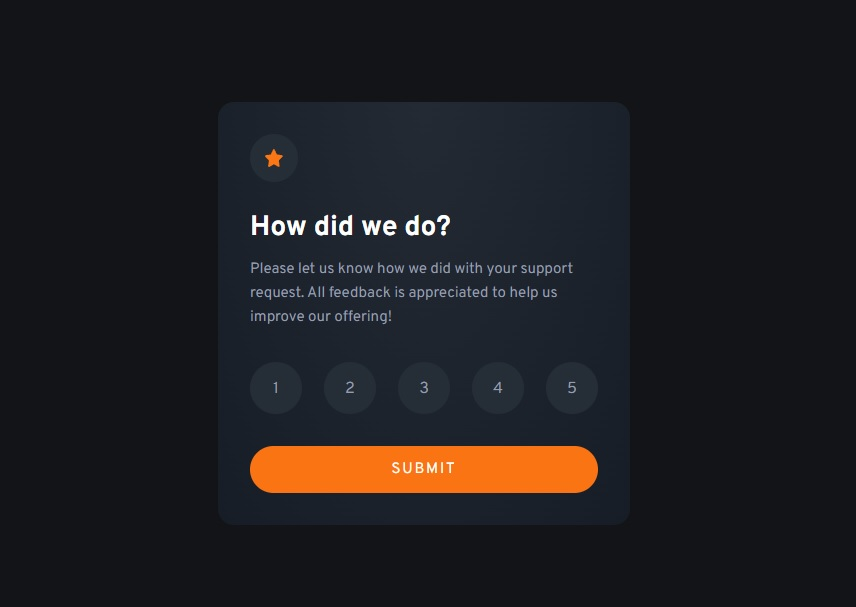

# Frontend Mentor - Interactive rating component solution

This is a solution to the [Interactive rating component challenge on Frontend Mentor](https://www.frontendmentor.io/challenges/interactive-rating-component-koxpeBUmI). Frontend Mentor challenges help you improve your coding skills by building realistic projects.

## Table of contents

- [Overview](#overview)
  - [The challenge](#the-challenge)
  - [Screenshot](#screenshot)
  - [Links](#links)
- [My process](#my-process)
  - [Built with](#built-with)
  - [What I learned](#what-i-learned)
- [Author](#author)

**Note: Delete this note and update the table of contents based on what sections you keep.**

## Overview

### The challenge

Users should be able to:

- View the optimal layout for the app depending on their device's screen size
- See hover states for all interactive elements on the page
- Select and submit a number rating
- See the "Thank you" card state after submitting a rating

### Screenshot

### Links

- Solution URL: [Link](https://github.com/avidworks/fem-interactive-rating-component)
- Live Site URL: [Link](https://avidworks.github.io/fem-interactive-rating-component/)

## My process

### Built with

- HTML, CSS, Vanilla JS

### What I learned

The biggest thing I wanted to focus on with this was to make sure everything remained as accessible as possible. To do that I used a proper HTML form with custom radio button inputs to toggle the feedback score.

## Author

- Website - [Add your name here](https://www.github.com/avidworks)
- Frontend Mentor - [@yourusername](https://www.frontendmentor.io/profile/avidworks)
- Twitter - [@yourusername](https://www.twitter.com/avdwrks)
